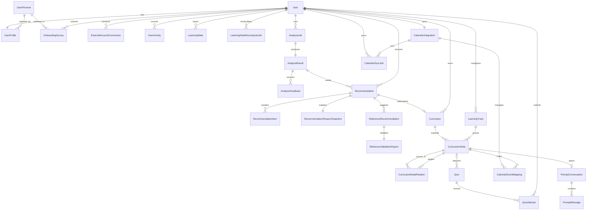
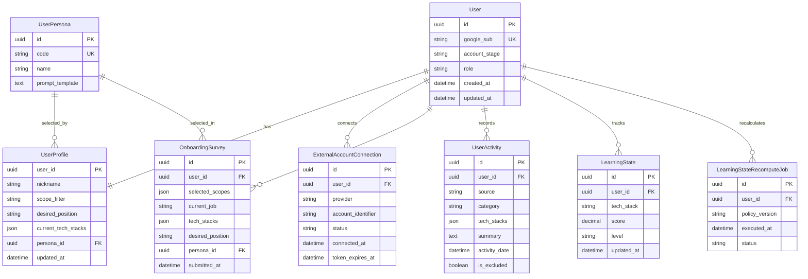
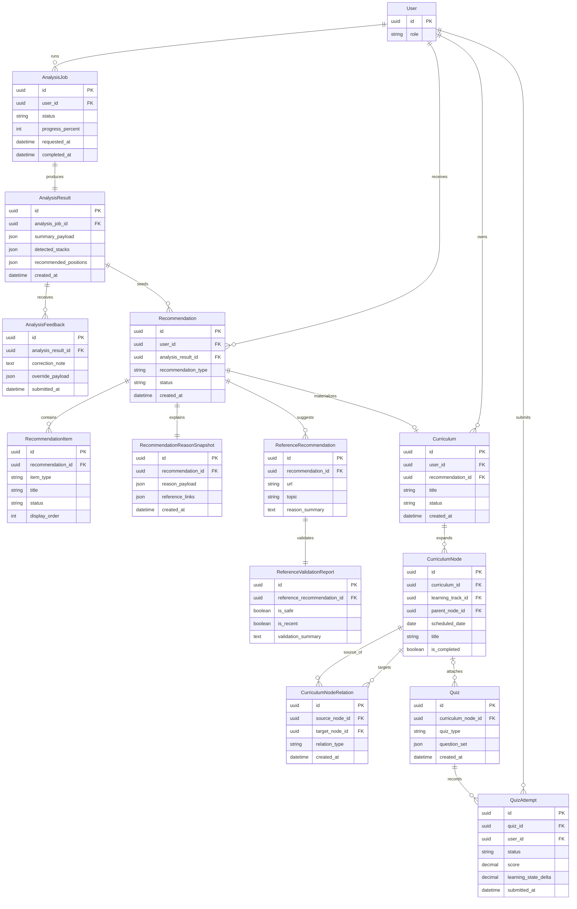
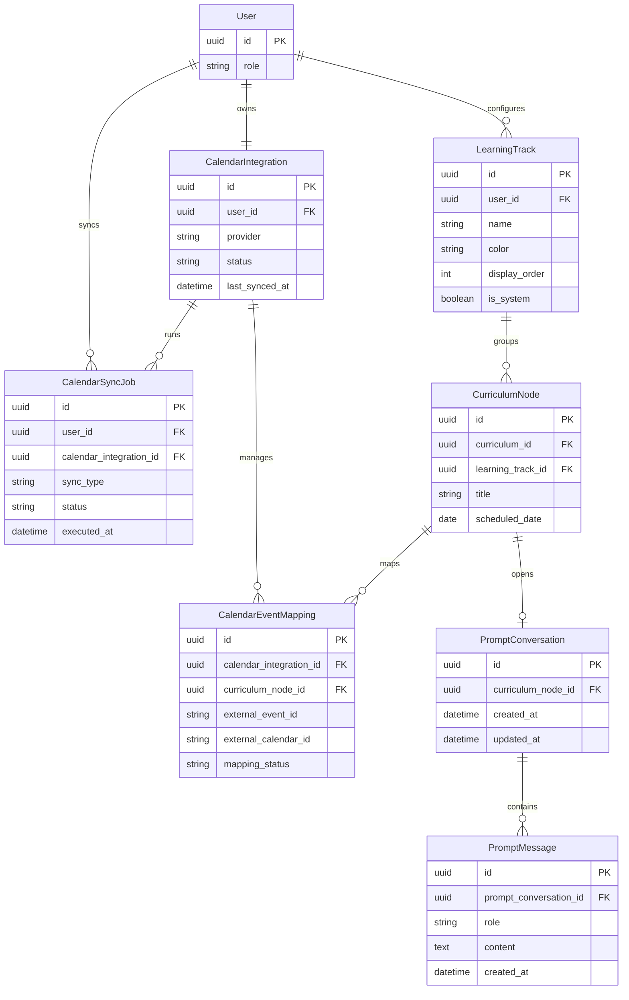

## **1. 문서 목적**

- 본 문서는 `document/02-table-spec.md`를 시각적으로 보완하는 논리 ERD 초안이다.
- `document/01-fun-spec.csv`의 MVP 요구사항을 만족하는 엔티티, 관계, 핵심 속성만 포함한다.
- 물리 컬럼 타입, 인덱스, 제약조건 확정 이전 단계의 설계 문서로 사용한다.

## **2. 작성 원칙**

- `UserActivity`를 서비스 전반의 단일 원천 활동 로그로 본다.
- 스킬 상태는 `LearningState` 1:N 구조를 정식 저장소로 본다.
- 외부 연동은 GitHub·Velog 필수 연동과 Google Calendar 연동으로 구분한다.
- 페르소나는 템플릿 기반 `UserPersona`만 사용한다.
- 캘린더 동기화는 `CalendarIntegration`, `CalendarSyncJob`, `CalendarEventMapping`으로 분리한다.
- 프롬프트 대화는 일정 노드별 `PromptConversation + PromptMessage`로 저장한다.

## **3. 전체 ERD**

## **4. 계정 · 프로필 · 활동 ERD**

## **5. 분석 · 추천 · 학습 ERD**

## **6. 캘린더 · 프롬프트 ERD**

