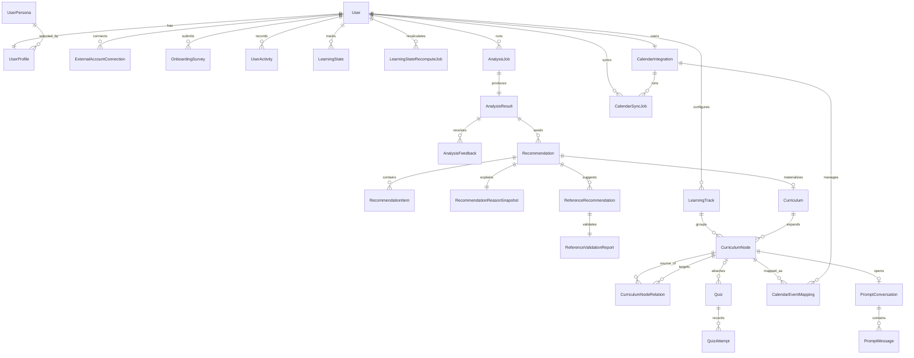

# **테이블(엔티티) 명세서**

## **1. 문서 목적**

- 본 문서는 `document/01-fun-spec.csv`를 기준으로 논리 엔티티와 관계를 정의한다.
- 범위는 MVP 핵심 기능의 데이터 모델링이며, 물리 컬럼 타입·인덱스·제약조건은 제외한다.
- 비-MVP 기능은 별도 확장 논의로 남기고 본 문서의 핵심 설계 범위에서는 제거한다.
- 상세 API 계약은 `document/04-api-spec.csv`, 시각 ERD는 `document/03-ERD.md`에서 관리한다.

## **2. 핵심 설계 쟁점 (Decision Record)**

| **쟁점** | **선택안** | **대안** | **최종 판단 이유** | **트레이드오프** |
| --- | --- | --- | --- | --- |
| 인증 진입 상태 | `User.account_stage`로 단계 관리 (`pending_signup`, `setup_required`, `user`, `admin`) | 역할 플래그 1개로만 처리 | 로그인, 회원가입, setup, 재진입 복구를 하나의 상태 흐름으로 설명할 수 있다. | 상태 전이 규칙을 명확하게 유지해야 한다. |
| 인증 수단 | Google OAuth only | 로컬 이메일/비밀번호 병행 | 현재 UI·기획 모두 Google OAuth 기준이다. | Google 장애 시 대체 로그인 수단이 없다. |
| 외부 서비스 연동 | GitHub·Velog를 회원가입 단계에서 모두 필수 연동 | 선택 연동 후 설정 화면에서 관리 | `NFR-057` 기준으로 두 연동 완료 전 다음 단계 진행을 차단해야 한다. | 회원가입 진입 장벽이 높아질 수 있다. |
| 페르소나 모델 | 온보딩/프로필 모두 `UserPersona` 템플릿 선택만 유지 | custom markdown 병행 | `01-fun-spec.csv`에서 custom persona 기능이 제거되었다. | 자유 입력형 커스터마이징은 지원하지 않는다. |
| 활동 이력 모델 | `UserActivity` 단일 원천 로그 + `is_excluded` 소프트 제외 | 별도 히스토리/제외 테이블 분리 | 히스토리, 추천 컨텍스트, 성장 요약에서 동일 원천을 재사용할 수 있다. | 단일 활동 테이블이 빠르게 커질 수 있다. |
| 캘린더 화면 구조 | `LearningTrack + CurriculumNode + CurriculumNodeRelation` 공용 사용 | 화면별 별도 일정 모델 | 메인 캘린더와 학습 캘린더가 동일 일정 원천을 공유한다. | 조회 shape를 화면별로 조합해야 한다. |
| 가져오기/동기화 모델 | Google Calendar persistent sync만 MVP 범위에 포함 | Notion/CSV import까지 포함 | `NFR-059` 기준으로 불러오기는 Google Calendar UX만 보장한다. | 향후 import source 확장 시 모델을 다시 열어야 한다. |
| 프롬프트 저장 범위 | 일정 노드별 `PromptConversation + PromptMessage` 영속 저장 | 프론트 local state만 사용 | 노드 재선택 시 이전 대화 복원을 만족해야 한다. | 대화 저장량과 AI 응답 비용이 증가한다. |

## **3. Must 엔티티**

| **엔티티** | **핵심 역할** | **프론트 근거** | **설계 메모** |
| --- | --- | --- | --- |
| `User` | 인증 계정 루트와 `account_stage` 관리 | `LoginPage`, `SignUpPage`, `SetupPage` | Google OAuth 가입 여부와 현재 진입 단계를 함께 관리한다. |
| `UserProfile` | 사용자의 최신 프로필 상태 | `SetupPage`, `MyPage` | 닉네임, 기술 스택, 정보 범위, 기본 persona template을 포함한다. |
| `UserPersona` | setup 화면에 노출되는 기본 페르소나 템플릿 | `SetupPage` | 드롭다운/선택형 페르소나 카탈로그다. |
| `ExternalAccountConnection` | 외부 서비스 연결 상태와 토큰 수명 관리 | `SignUpPage`, `MyPage` | GitHub·Velog 필수 연동 상태와 공급자별 토큰 상태를 저장한다. |
| `OnboardingSurvey` | setup 단계 입력 스냅샷 | `SetupPage` | 직업, 기술 스택, 희망 포지션, persona template 당시값을 보존한다. |
| `UserActivity` | 서비스 전반의 단일 원천 활동 로그 | `StudyCalendarPage`, `HistoryPage` | `calendar_manual`, `calendar_google`, `app_quiz`, `app_reference` 등을 수용한다. |
| `LearningState` | 사용자별 기술 스택 점수와 최신 상태 | `DashboardPage`, `QuizPage` | 분석 결과, 퀴즈 결과, 성장 요약의 기반 데이터다. |
| `LearningStateRecomputeJob` | 주기적 점수 재계산 실행 이력 | 분석/성장 요약 배치 | 월 단위 재계산과 정책 버전을 함께 추적한다. |
| `AnalysisJob` | 분석 요청과 진행률 추적 단위 | `LoadingPage` | 비동기 분석 상태와 단계별 진행률을 관리한다. |
| `AnalysisResult` | 분석 결과 화면에 노출되는 요약 산출물 | `DashboardPage` | 기술 스택, 숙련도, 추천 포지션, 카드/차트 데이터를 보관한다. |
| `AnalysisFeedback` | 분석 결과 수정 입력 및 재분석 근거 | `FeedbackPage` | 사용자의 교정 입력과 override payload를 저장한다. |
| `Recommendation` | 추천 세션의 헤더 단위 | `CurriculumSuggestPage`, `RecommendPage` | 최초 추천, 맞춤 추천, 신규 학습 추천의 루트다. |
| `RecommendationItem` | 추천 세션 내 개별 제안 항목 | `CurriculumSuggestPage`, `ActivitySelectPage` | 커리큘럼, 퀴즈, 레퍼런스 제안을 상태와 함께 관리한다. |
| `RecommendationReasonSnapshot` | UI 재현용 추천 근거 스냅샷 | `CurriculumSuggestPage`, `MainPage` | 추천 이유, 링크, 카드/모달 표시용 요약을 저장한다. |
| `ReferenceRecommendation` | 레퍼런스 추천 항목 | `ActivitySelectPage`, `RecommendPage` | URL, 주제, 추천 이유, 태그를 저장한다. |
| `ReferenceValidationReport` | 레퍼런스 검증 결과 | `RecommendPage` | 안전성, 최신성, 적합성 검증 결과를 보관한다. |
| `Curriculum` | 추천 수락 또는 업로드 기반 학습 계획 묶음 | `CurriculumSuggestPage`, `RecommendPage` | 추천 기반/업로드 기반 일정의 루트 단위다. |
| `LearningTrack` | 캘린더 트랙 설정 | `MainPage`, `StudyCalendarPage` | 이름, 색상, 정렬 순서, 시스템 트랙 여부를 가진다. |
| `CurriculumNode` | 캘린더에 배치되는 일정 노드 | `MainPage`, `StudyCalendarPage` | 날짜, 제목, 태그, 상태, track 연결을 가진 공통 일정 원천이다. |
| `CurriculumNodeRelation` | 일정 노드 간 선후행 연결선 | `MainPage` | 그래프 뷰의 edge를 모델링한다. |
| `Quiz` | 생성된 퀴즈 세트 | `QuizPage`, `QuizActivityPage` | 복습 퀴즈와 사전 퀴즈를 모두 포함한다. |
| `QuizAttempt` | 사용자의 퀴즈 응시 결과 | `QuizPage`, `QuizActivityPage` | 응답, 채점 결과, 미응답 여부, learning state 반영량을 저장한다. |
| `CalendarIntegration` | Google Calendar persistent 연결 상태 | `StudyCalendarPage` | 연결 여부와 연결 계정 요약을 관리한다. |
| `CalendarSyncJob` | Google Calendar pull/push 실행 이력 | `StudyCalendarPage` | 일정 불러오기/일정 반영하기 실행 이력을 남긴다. |
| `CalendarEventMapping` | 내부 일정과 Google Calendar 이벤트 매핑 | `StudyCalendarPage` | Google Calendar 반영 후 mapping을 유지한다. |
| `PromptConversation` | 일정 노드별 프롬프트 대화 스레드 | `MainPage` prompt view | 노드별 대화 복원을 위한 스레드 단위다. |
| `PromptMessage` | 프롬프트 대화 메시지 | `MainPage` prompt view | user/assistant 역할, 본문, 시각을 저장한다. |

## **4. 주요 관계**

| **No.** | **관계** | **카디널리티** | **설계 이유** |
| --- | --- | --- | --- |
| 1 | `User -> UserProfile` | 1:1 | 인증 계정과 수정 가능한 프로필 상태를 분리한다. |
| 2 | `UserProfile -> UserPersona` | N:1 | setup 단계의 기본 persona template 참조를 지원한다. |
| 3 | `User -> ExternalAccountConnection` | 1:N | GitHub·Velog 공급자별 연동 상태를 분리 관리한다. |
| 4 | `User -> OnboardingSurvey` | 1:N | setup 당시 입력값을 스냅샷으로 보관한다. |
| 5 | `User -> UserActivity` | 1:N | 히스토리와 추천 컨텍스트의 공통 원천이다. |
| 6 | `User -> LearningState` | 1:N | 기술 스택별 상태를 분리 저장한다. |
| 7 | `User -> LearningStateRecomputeJob` | 1:N | 재계산 이력을 남긴다. |
| 8 | `User -> AnalysisJob` | 1:N | 분석 요청은 반복 실행될 수 있다. |
| 9 | `AnalysisJob -> AnalysisResult` | 1:1 | 실행 단위와 결과 payload를 분리한다. |
| 10 | `AnalysisResult -> AnalysisFeedback` | 1:N | 하나의 분석 결과에 여러 차례 피드백이 들어올 수 있다. |
| 11 | `AnalysisResult -> Recommendation` | 1:N | 분석 결과를 기반으로 여러 추천 세션이 파생된다. |
| 12 | `Recommendation -> RecommendationItem` | 1:N | 추천 세션 내 개별 제안을 분리한다. |
| 13 | `Recommendation -> RecommendationReasonSnapshot` | 1:1 | UI에 재사용할 추천 근거를 구조화해 저장한다. |
| 14 | `Recommendation -> ReferenceRecommendation` | 1:N | 한 추천 세션에 여러 레퍼런스가 포함될 수 있다. |
| 15 | `ReferenceRecommendation -> ReferenceValidationReport` | 1:1 | 레퍼런스별 검증 결과를 연결한다. |
| 16 | `Recommendation -> Curriculum` | 1:0..1 | 수락된 추천만 커리큘럼으로 물질화된다. |
| 17 | `User -> LearningTrack` | 1:N | 사용자별 트랙 설정을 저장한다. |
| 18 | `LearningTrack -> CurriculumNode` | 1:N | 각 일정 노드는 하나의 트랙에 속한다. |
| 19 | `Curriculum -> CurriculumNode` | 1:N | 추천/업로드 기반 커리큘럼은 여러 일정 노드를 포함한다. |
| 20 | `CurriculumNode -> CurriculumNodeRelation` | 1:N | 노드 간 연결선을 표현한다. |
| 21 | `CurriculumNodeRelation -> CurriculumNode` | N:1 | 각 연결선은 하나의 target node를 가리킨다. |
| 22 | `CurriculumNode -> Quiz` | 1:N | 일정 노드와 퀴즈를 연결할 수 있다. |
| 23 | `Quiz -> QuizAttempt` | 1:N | 한 퀴즈 세트에 여러 응시가 가능하다. |
| 24 | `User -> CalendarIntegration` | 1:1 | Google Calendar persistent 연결 상태를 관리한다. |
| 25 | `User -> CalendarSyncJob` | 1:N | Google Calendar pull/push 실행 이력을 남긴다. |
| 26 | `CalendarIntegration -> CalendarSyncJob` | 1:N | 하나의 연결 컨텍스트에서 여러 sync가 발생한다. |
| 27 | `CurriculumNode -> CalendarEventMapping` | 1:N | Google Calendar event 매핑을 유지한다. |
| 28 | `CalendarIntegration -> CalendarEventMapping` | 1:N | 같은 integration 안에서 mapping을 관리한다. |
| 29 | `CurriculumNode -> PromptConversation` | 1:0..1 | 현재 UX는 노드당 하나의 대화 스레드에 가깝다. |
| 30 | `PromptConversation -> PromptMessage` | 1:N | 대화 스레드 내 메시지는 시간순으로 누적된다. |

## **5. Mermaid ERD (핵심 관계)**

## **6. 미결정 설계 메모**

- prompt view를 노드당 단일 스레드로 고정할지, 사용자가 여러 스레드를 생성할 수 있게 할지는 추후 결정한다.
- GitHub 심층분석, 포트폴리오 추천, 블로그 어시스턴트, Notion/CSV import는 본 문서 MVP 범위에서 제외한다.
